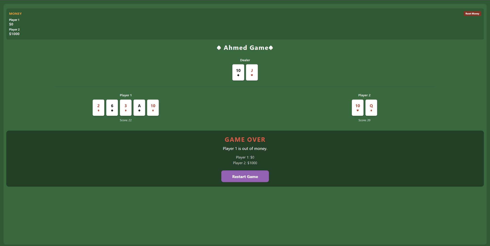
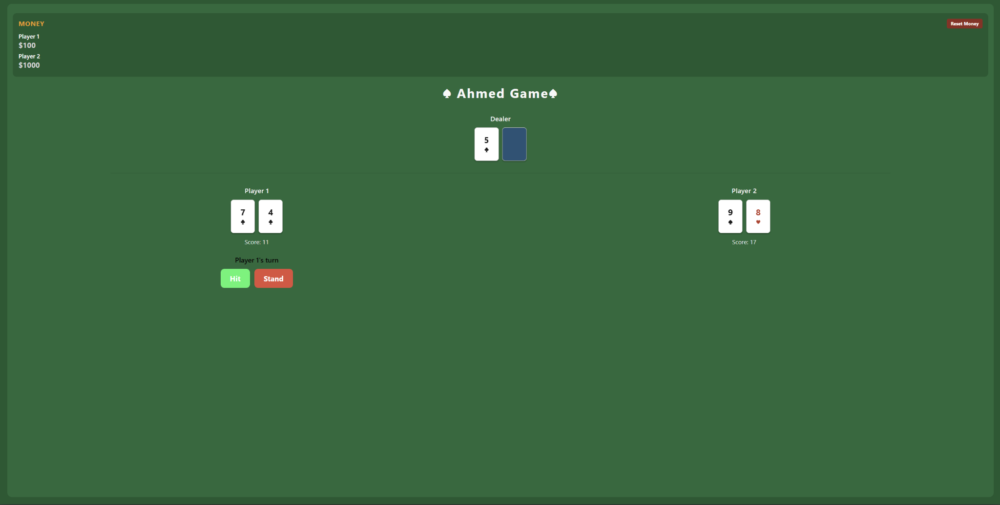
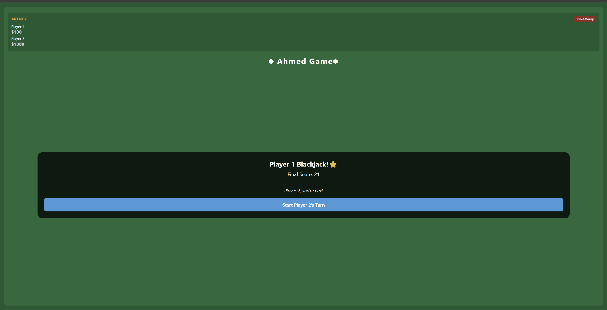
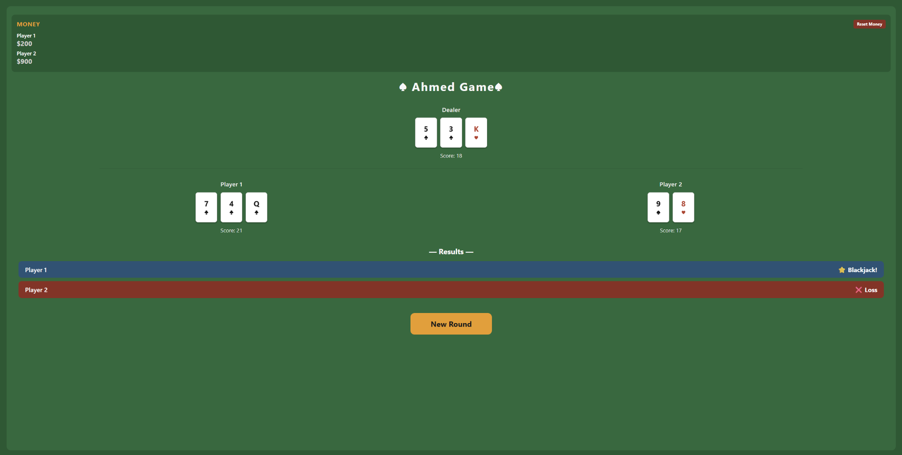

# ♠ BlackJack – React Native Game

A simple two-player Blackjack game built with **React Native**, **TypeScript**, and **Expo**.

The project was created as a practical mobile-development case study to learn component-based UI development, state management, game logic, testing, and Git/GitHub workflow.

## 🎮 Features

- Two local players on the same device
- Automated dealer
- Standard card dealing flow
- **Hit** and **Stand** actions
- Player turn transitions
- Player 1 and Player 2 displayed side by side
- Dealer hand with a hidden card during the round
- Automatic dealer play
- Round result screen
- Blackjack, win, loss, push, and bust states
- Money system for both players
- Each player starts with **$1000**
- Fixed **$100** gain/loss per round
- Money is tracked independently for each player
- Money never goes below **$0**
- Game ends when a player runs out of money
- **Restart Game** option after Game Over
- **Reset Money** option

## 💰 Money Rules

Each player starts with:

```text
$1000
```

The current version uses a fixed amount of **$100 per round**.

- Win → `+$100`
- Loss → `-$100`
- Bust → `-$100`
- Push / Tie → no change
- Blackjack → `+$100`

If a player's balance reaches **$0**, the game ends and a Game Over screen is displayed.

## 🛠 Technologies

- **React Native** – mobile UI framework
- **TypeScript** – application and game logic
- **Expo** – development and testing environment
- **Git** – version control
- **GitHub** – remote repository hosting
- **Antigravity** – AI-assisted development environment used during development

## 📸 Screenshots

### Game Over

A player's balance cannot go below zero. When a player reaches `$0`, the game ends and the final balances are displayed.



### Gameplay

Player 1 and Player 2 are displayed side by side while the dealer remains centered above them.



### Turn Transition

A transition screen is shown before control moves from one player to the next.



### Round Results

At the end of the round, the dealer and player hands are shown together with the result of each player.



## 🚀 Run the Project

### 1. Clone the repository

```bash
git clone https://github.com/AhmadAziizi/BlackJack.git
cd BlackJack
```

### 2. Install dependencies

```bash
npm install
```

### 3. Start Expo

```bash
npx expo start
```

For web testing, after Expo starts you can press:

```text
w
```

or run:

```bash
npx expo start --web
```

## 🧠 What I Practiced

This project was used to practice:

- React Native components
- Props and callback functions
- `useState` and application state
- Conditional rendering
- TypeScript interfaces and types
- Game-state transitions
- Separating UI components from game logic
- Testing different game scenarios
- Git commands such as `status`, `diff`, `add`, `commit`, `log`, and `push`
- GitHub-based version control workflow

## 📂 Main Project Structure

```text
BlackJack/
├── App.tsx
├── components/
│   ├── ActionButtons.tsx
│   ├── Hand.tsx
│   ├── ResultBanner.tsx
│   ├── Scoreboard / Money display
│   └── TransitionOverlay.tsx
├── game/
│   ├── deck.ts
│   └── logic.ts
├── types/
└── package.json
```

## 🔮 Possible Future Improvements

- Configurable bet amount
- Proper Blackjack payout rules
- Split / double-down support
- Improved mobile-responsive layout
- Sound effects and animations
- Persistent money using local storage
- Better automated tests for game logic

## 👤 Author

**Ahmad Azizi**

GitHub: [AhmadAziizi](https://github.com/AhmadAziizi)

---

This project is intended as a learning project for React Native, TypeScript, Expo, and Git-based development.
